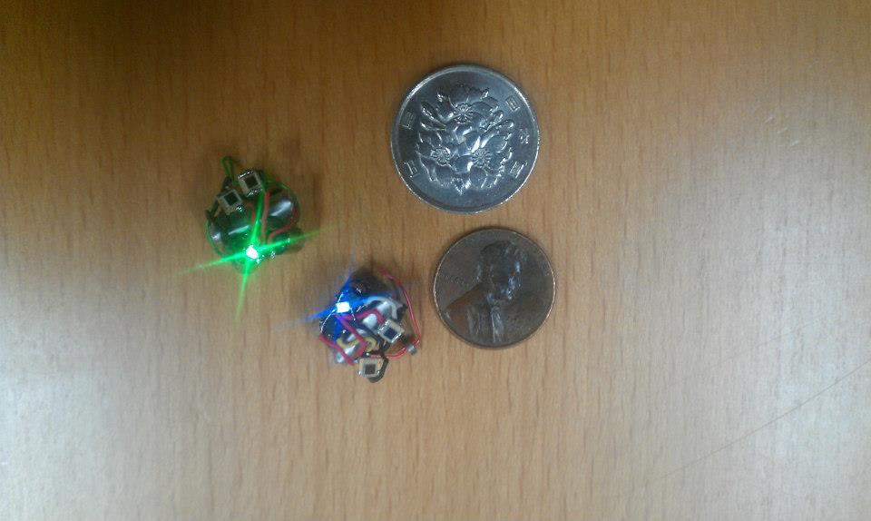

#### Third, create a technical essay (approximately 3-4 paragraphs) that discusses your interests in software engineering and what kinds of skills and experiences you hope to develop in future.

My interest in Computer Engineering initially began back in intermediate with robotics. Robotics back then was nothing more than a fun activity which I participated in with friends. It wasn't until my last year in intermediate school did I start participating my my high school's micro robotics team. In this micro robotics team, I learned how to design and fabricate printed circuit boards. This was leagues ahead of what I was used to working on and working on technical work at that time felt really fulfilling. A few years later, I would begin coding the microrobots in C++.

Working on microrobots in high school really developed my skills in both hardware development and programming. Having built the hardware and later programming for it, the importance of design considerations was highlighted. Working on both simultaneously helped bridge the hardware and software components. This greatly influenced my decision in pursuing computer engineering.

While pursuing my computer engineering degree, I slowly realized how focused many of the programming classes were on algorithms or hardware/firmware interfaces. Much of the higher level programming languages and problems were never included in the computer engineering curriculum. By participating in a software engineering, I hope to gain experience programming for front end applications which hopefully include web development.
