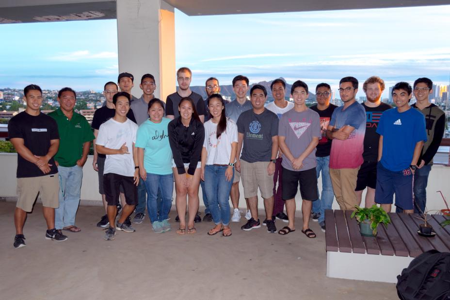

VIP UHDT is a program whose purpose is to develop unmanned aerial systems for search and rescue applications. VIP UHDT is a multidisciplinary program which includes computer engineering, electrical engineering, mechanical engineering and pre-engineering students. Every year, VIP UHDT participates in the AUVSI Seafarer competition hosted by the US Navy which simulates search and rescue scenarios. Primary tasks of the competition include autonomous flight, waypoint navigation, image capture and navigation, and obstacle avoidance. Tasks are to be completed within 20 minutes with an additional 10 minutes of post mission processing time.

VIP UHDT's UAS consists of a dual engined, fixed wing drone with a payload capacity of 5kg. Flight electronics include a Pixhawk flight controller, Raspberry Pi, camera and various sensors and radios. Radios installed on the drone operate on the 900MHz, 1.3GHz, 2.4GHz and 5.8GHz frequency bands. Operational range of the drone are limited by the radios and have been calculated to be in excess of 2km. Actual operational range has been verified to at least 1.5km. The UAS is powered by lithium polymer batteries giving it an operational flight time of 20 - 30 minutes.

This project was started in the fall of 2015. Since fall 2015, I have served as the electronics and communications subsystem lead. This subsystem is in charge of the ground station, electronics payload of the drone, radio communications and software facilitating image transfer. I developed majority of the electronics payload on the drone. This includes the flight/navigation systems, safety pilot video feed and image capture/transfer systems. I also calculated the operational range of the UAS based upon parts specifications and Friis equations. I have also done limited development of the image transferring software which included encryption and file transfer protocols.

Since 2015, VIP UHDT has participated in two AUVSI Seafarer competitions in 2016 and 2017 and placed 26th and 4th respectively.

The VIP UHDT project is special in the regard that it encompasses all aspects of the system, ranging from hardware and software, to mission planning. Due to the scale of the project, I have learned to implement system level design concepts as well as project management. I also learned the basics of radio frequency (RF) calculations which allowed the system and mission plan to be designed around the system's theoretical operational range. I was also able to reinforce my existing knowledge by applying my server management skills to the image transferring system as well as electrical knowledge to the design and assembly of a power distribution board.

You can learn more at the [VIP UHDT Website](http://rip.eng.hawaii.edu/projects/uhdt-2017-2018/).

