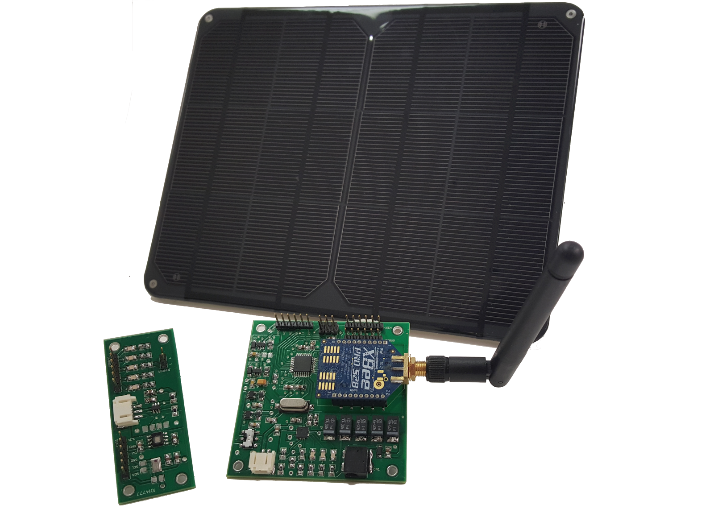

The Smart Campus Energy Lab researches weather/environmental data for weather analysis and prediction which will be used to help conserve campus-wide energy use.

SCEL is currently deploying weatherboxes on the roof of Holmes Hall. Current weatherbox designs are based upon Arduino circuits with additional sensors and radios for data collection and transmission. Environmental data gathered by the weatherboxes are transmitted wirelessly to a central hub which parses the data and stores it in a postgres database. Intial data collection is ongoing and analysis will be tested once sufficient data is collected.

The project is comprised of multiple subteams which work on hardware, firmware and software. I am a member of the software team whose primary responsibilities include the development of the firmware for the weatherboxes as well as the backend for the data management. I have contributed to the development of the firmware as well as developing a modular testing platform which allowed the software team to develop firmware independently from the hardware team workflows. I have also implemented a reverse proxy for the backend server which facilitates the implementation of an API for future modularity.

SCEL is one of the larger EE projects labs for EEx96. As a member of the software team, I had to interact with numerous hardware teams. Over the course of the project, I learned the importance of communication in multidisciplinary projects. One of the problems we regularly faced was optimizations or added features weren't adequately discussed with the software team. This lack of communication lead to numerous revisions and workarounds in the firmware for the hardware. This lead to many delays which easily could've been mitigated had enough discussion taken place.

More information about this project can be found on the [SCEL Project Website](http://scel-hawaii.org/) as well as the [SCEL Project Wiki](https://wiki.scel-hawaii.org/doku.php).
