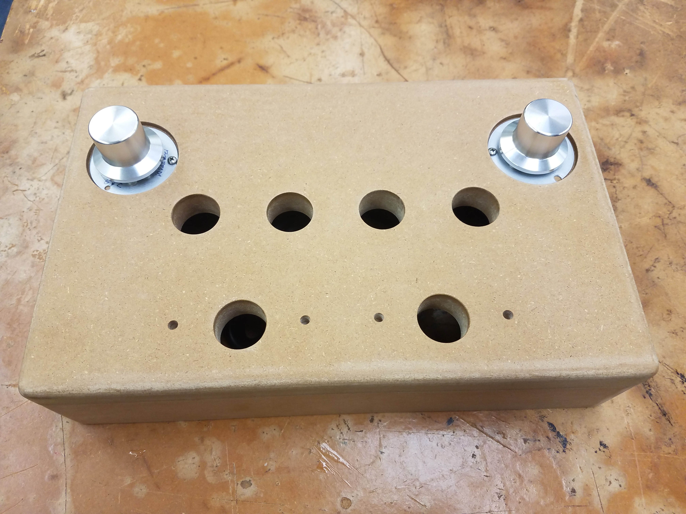

Sound Voltex/K-Shoot Mania is a rhythm game which originated in Japan. Motivated by the high cost of commercial gamepads, I set out to create a DIY version. For this particular revision, I decided to be liberal with the design and substitute the main buttons with 33mm buttons (original 60mm).

The current software design is built for the open-source version of SDVX, K-Shoot mania. Further designs will include persistent setting storage and increased compatability with b_____ tools. The SDVX application and b_____ tools will also be attempted to be ported to Debian via wine.

The source code for the firmware can be found [here](https://github.com/Reyn-Mukai/Bemani-SDVX).
