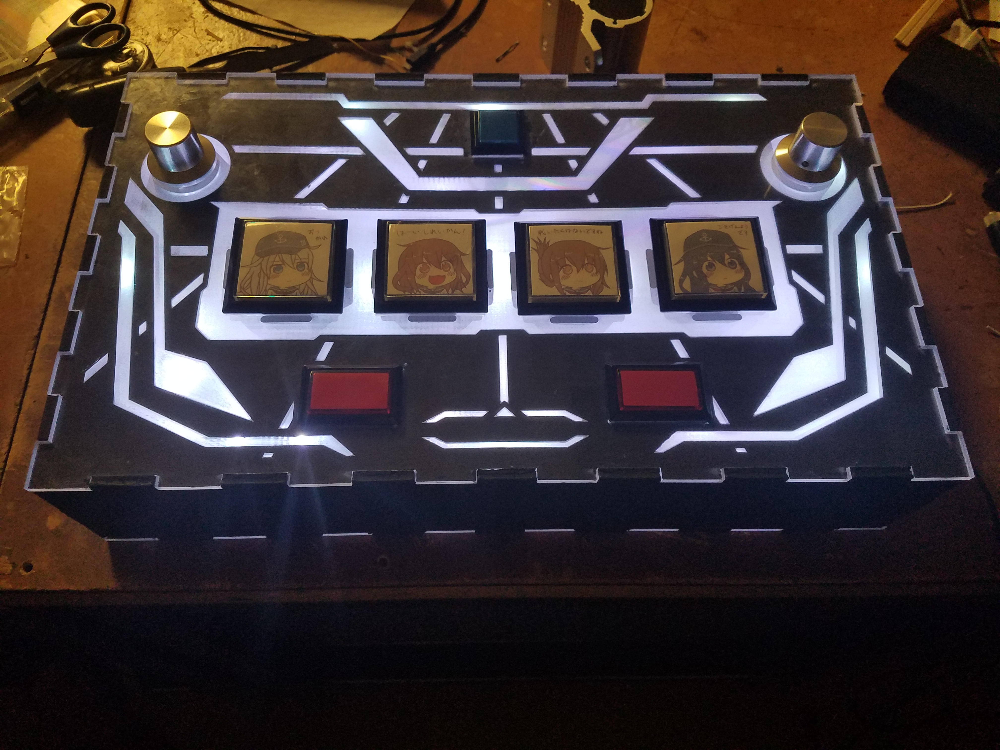

Sound Voltex/K-Shoot Mania is a rhythm game which originated in Japan. Motivated by the high cost of commercial gamepads, I set out to create a DIY version. For this design, several design choices were made at the outset which were to make the controller smaller than a typical commercial controller and to use an Arduino as a base. To achieve the smaller size, 33mm square buttons were used instead of 60mm buttons to reduce the overall footprint. An Atmega32u4 was selected as the main microcontroller due to the integrated USB interface which allowed the microcontroller to be recognized as a HID. This also reduced circuit complexity as using an external interface would require two separate firmwares and a in circuit communication link which could lead to reliability problems and/or latency issues.

The current software design is built for the open-source version of SDVX, K-Shoot mania. As such, the firmware itself reports to the host computer that it is both a keyboard and a mouse. Button presses send ASCII characters to the host computer and the rotary knobs send X/Y axis movements. Further designs will include persistent setting storage via EEPROM and increased compatibility with b***** tools. Further compatability will include a mode where the microcontroller reports itself as a gamepad to the host computer. This will reduce compatability issues with the closed-source version of SDVX. The SDVX application and tools will also be attempted to be ported to Debian 9 via wine.

While this current project is ongoing, I was able to apply several skills which I have acquired over the years. For the initial frame, I utilized a 3D printer to print small scale prototype boxes. For the electronics, I had to solder components onto protoboard to test both hardware and software based debounce. Programming for the controller is still ongoing and makes use of 3rd party libraries to accomplish USB communication with the host computer.

The source code for the firmware can be found [here](https://github.com/Reyn-Mukai/SDVX-DIY/) and the tutorial can be found [here](https://sdvx-diy.github.io/).
