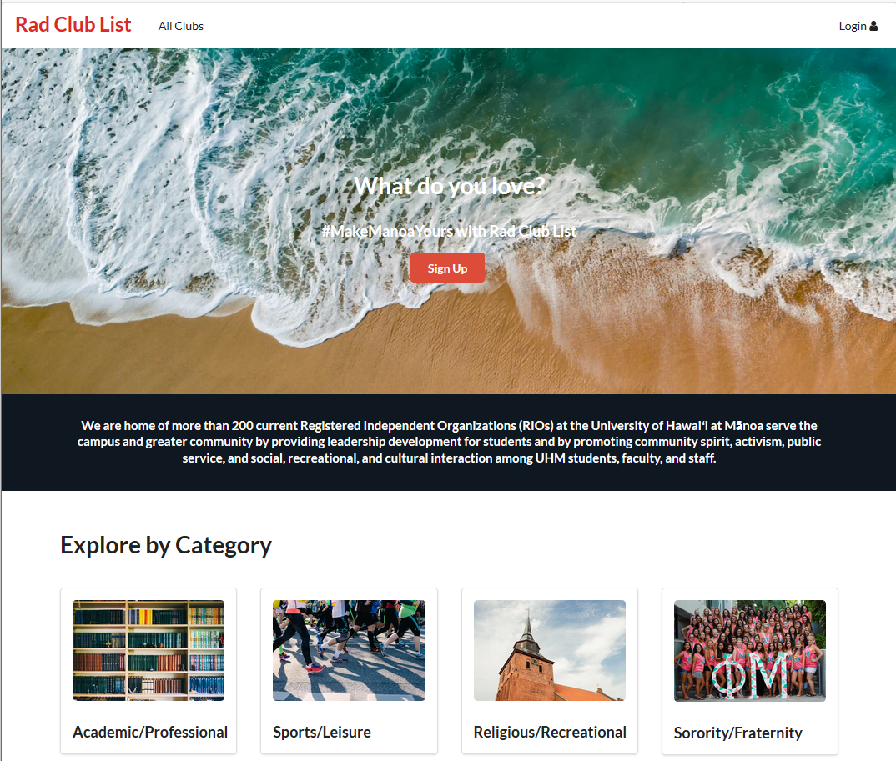

Finding clubs at the Univserity of Hawaii at Manoa is a daunting task as there are well over 300 registered independent organizations. To address this issue, a team an I decided to develop a web application which would help alleviate this problem.

The RadClubList application was designed to help students find clubs and informtaion. Users are able to search through all RIO's at the Univserity of Hawaii at Manoa and can sort RIO's by category. Administrators of clubs can obtain access to their club page and modify their club's information.

My role on this project was to design the layout and functionality of the web application. Much of the development relied on semantic ui as well as Meteor integration for linking to other pages. Some of the pages I helped develop included the landing page and club registration page.

An overview of the project page can be found [here](https://rcl808.github.io/).
